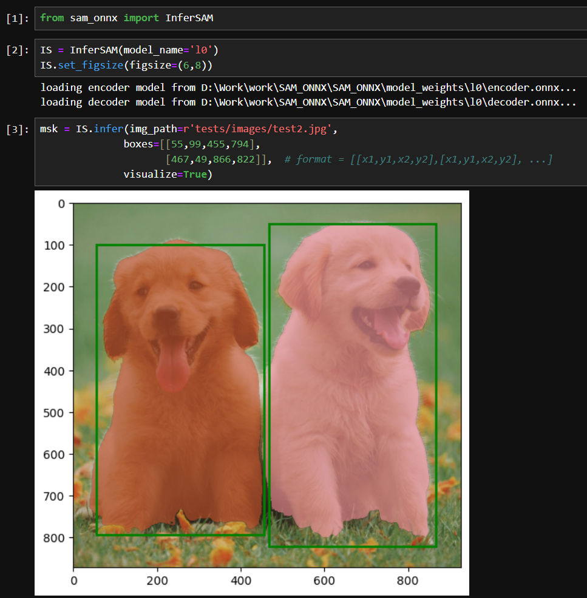

# SAM ONNX (* Under Development)
`
Welcome to the documentation for Project Name! This repository contains the source code for the project.

## Environment creation Creation (For Development)

> python -m venv sam_onnx_env

- Use pip 24.0 or higher version 

## Installation
In SAM_ONNX Folder
> python -m pip install -e .

## Usage

## License

This project is licensed under the [MIT License](LICENSE).